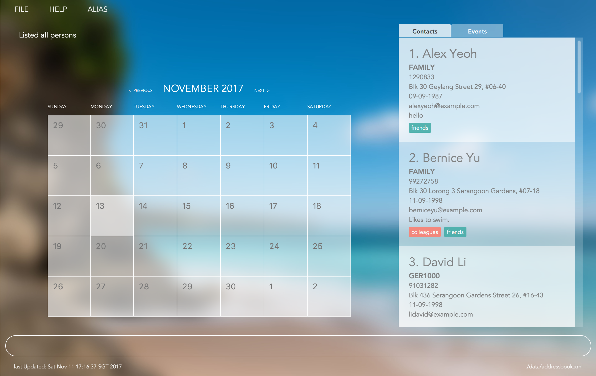
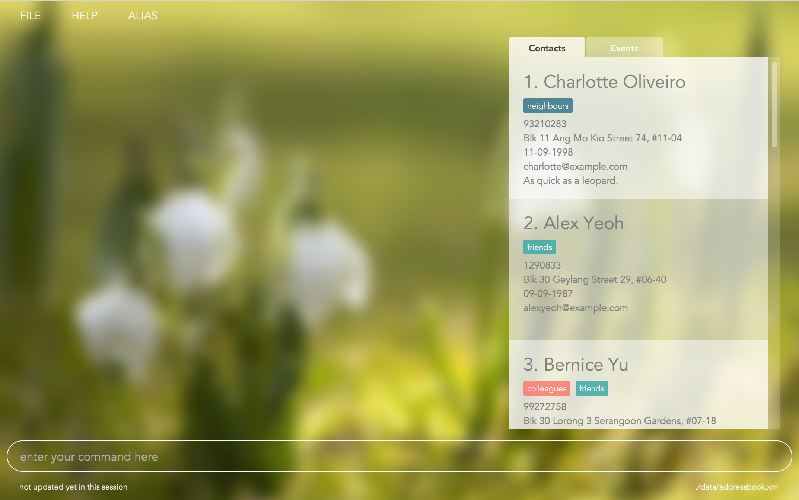
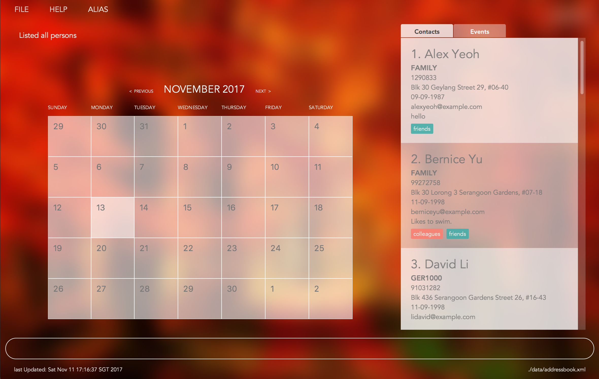
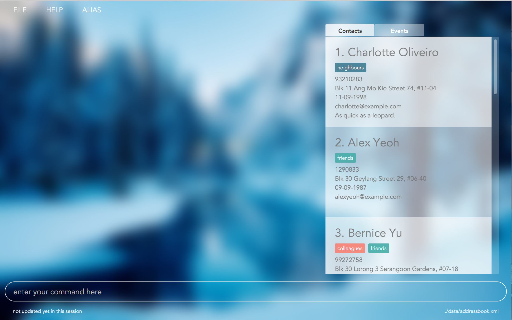

= TunedIn
ifdef::env-github,env-browser[:relfileprefix: docs/]
ifdef::env-github,env-browser[:outfilesuffix: .adoc]

https://travis-ci.org/CS2103AUG2017-T14-B2/main[image:https://travis-ci.org/CS2103AUG2017-T14-B2/main.svg?branch=master[Build Status]]
https://ci.appveyor.com/project/damithc/addressbook-level4[image:https://ci.appveyor.com/api/projects/status/3boko2x2vr5cc3w2?svg=true[Build status]]
https://coveralls.io/github/se-edu/addressbook-level4?branch=master[image:https://coveralls.io/repos/github/se-edu/addressbook-level4/badge.svg?branch=master[Coverage Status]]
https://www.codacy.com/app/damith/addressbook-level4?utm_source=github.com&utm_medium=referral&utm_content=se-edu/addressbook-level4&utm_campaign=Badge_Grade[image:https://api.codacy.com/project/badge/Grade/fc0b7775cf7f4fdeaf08776f3d8e364a[Codacy Badge]]

ifdef::env-github[]

endif::[]

ifndef::env-github[]
image::images/Ui.png[width="600"]
endif::[]

ifdef::env-github[]

endif::[]

ifndef::env-github[]
image::images/Ui2.png[width="600"]
endif::[]

ifdef::env-github[]

endif::[]

ifndef::env-github[]
image::images/Ui3.png[width="600"]
endif::[]

ifdef::env-github[]

endif::[]

ifndef::env-github[]
image::images/Ui4.png[width="600"]
endif::[]

* Welcome to TunedIn, a free-to-use application that brings to you the power of a full-fledged command line personal
organizer, bundled together with a user-friendly interface that keeps all of your information easily accessible and
at your fingertips.
* TunedIn has a GUI but most of the user interactions happen using a CLI (Command Line Interface).
* It is a Java application intended for users to have a cohesive environment to store information and relevant
information in the form of a personal planner.
* It is *written in OOP fashion*.
* What's new in v1.4:
** New functions: *settheme*

== Who should use TunedIn

* TunedIn is designed for less technologically inclined users to harness the power of a CLI organizer without a steep
learning curve.
* That said, TunedIn has functionality suitable for more advanced users as well.

== Site Map

* <<UserGuide#, User Guide>>
* <<DeveloperGuide#, Developer Guide>>
* <<AboutUs#, About Us>>
* <<ContactUs#, Contact Us>>

== Acknowledgements

* Some parts of this sample application were inspired by the excellent http://code.makery.ch/library/javafx-8-tutorial/[Java FX tutorial] by
_Marco Jakob_.
* This application was built off the AddressBook-Level4 project created by SE-EDU initiative at https://github.com/se-edu/.

== Licence : link:LICENSE[MIT]
